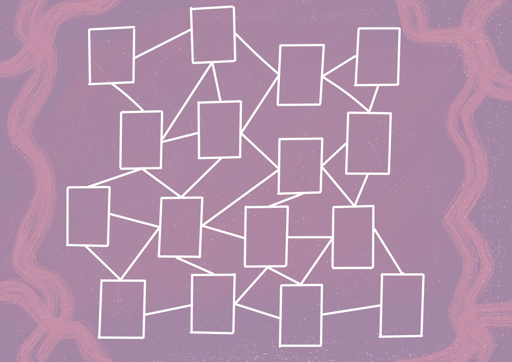

## 地图设计-PVE
#### 对战地图
将月相牌打在不同的格子上，这些格子组成不同的几何形状，可能同时有多个不相连的形状需要填充，也可能都是相连在一起的

一个格子只能放一张牌，格子打满时游戏结束

每章会有不同的对战地图，地图中的格子数量会随进度而增加，分别是9，12，14，14，16，16，以控制游戏时长

#### 第一章

#### 第二章

#### 第三章

#### 第四章

#### 第五章

#### 第六章（已画好）
* 色调：粉紫，符合剧情
* 格子连接程度：复杂

